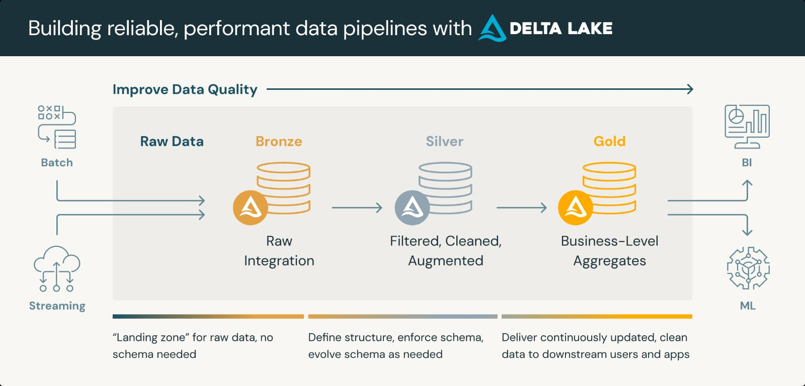
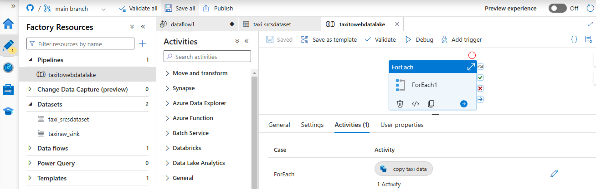
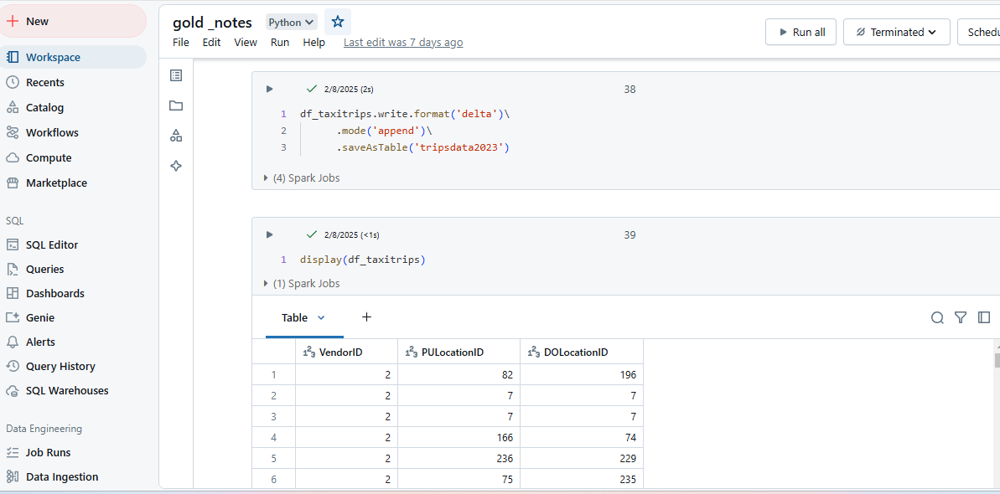
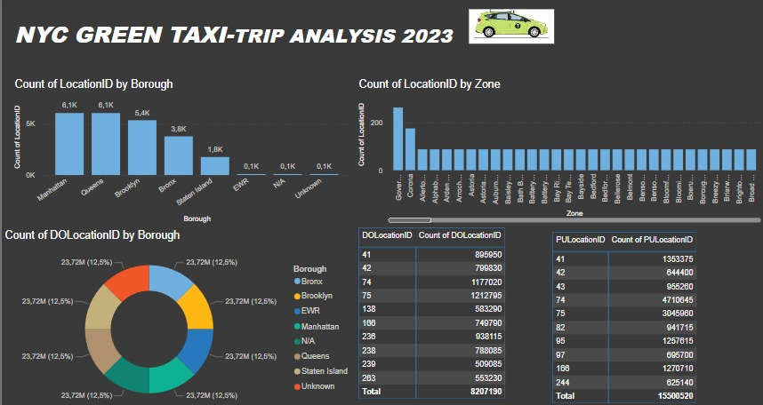

---

## **1. Introduction**  
This project is an end-to-end **NYC Green Taxi project** built using **Azure Data Factory, Databricks, Delta Lake, and Power BI**. It follows a structured **Medallion Architecture (Bronze, Silver, Gold)** to ensure optimized data processing, transformation, and reporting.  
 
---
## **Medallion Architecture Diagram **
  

---
## **2. Skills Demonstrated**  
✅ **Data Engineering** → Data ingestion, transformation, and storage using **Azure Data Factory & Databricks**.  
✅ **Data Modeling** → Implemented **Medallion Architecture** (Bronze, Silver, Gold) for structured data processing.  

---

## **3. Data Sourcing**  
- **Fetched data directly from the website.**  
- **Azure Data Factory** was used for ingestion via **API connections**.  
- Data was stored in **Azure Data Lake (Gen2)** using **Parquet format** for efficiency.  
 

---

## **4. Data Transformation**  
✔ **Bronze Layer:** Raw data stored in **Parquet format**.  
✔ **Silver Layer:** Used **PySpark transformations** to clean and filter the data.  
✔ **Gold Layer:** Created **Delta Tables** for efficient querying in Power BI.  

### **Specific Transformation:**  
- Filtered **Top 10 Pickup & Drop-off Locations** based on trip count.  
- Aggregated data for **performance optimization** in Power BI.  

---

## **5. Analysis & Visualizations**  
Key Insights from Power BI Dashboard:  
- **Top Boroughs & Zones:** Identified **high-demand locations** (e.g., JFK, Manhattan).  
- **Trip Volume Trends:** Analyzed **peak hours and days** for better fleet management.  
- **Drop-off vs. Pickup Patterns:** Helped **optimize taxi allocation strategies**.
  

---
## **6. Technologies Used**  
- **Azure Data Factory** → Data ingestion via **APIs**.  
- **Databricks** → Managed **clusters, transformations, and Delta Tables**.  
- **Azure Data Lake Gen2** → Stored data in **Parquet & Delta format**.  
- **Power BI** → Built **interactive dashboards & visualizations**.  

---

## **7. Challenges & Growth**  

### **Challenges Faced:**  
❌ **Large data volume** – Optimized using **Parquet & Delta Tables**.  
❌ **Security restrictions** – Implemented **Service Principal for Data Lake access**.  
❌ **Performance issues in Power BI** – Solved by **filtering top 10 locations**.  

### **Growth & Learning:**  
✅ Improved **Azure Data Engineering** skills.  
✅ Gained experience in **Databricks Cluster Management**.  
✅ Enhanced **Power BI Report Optimization** techniques.  

---

